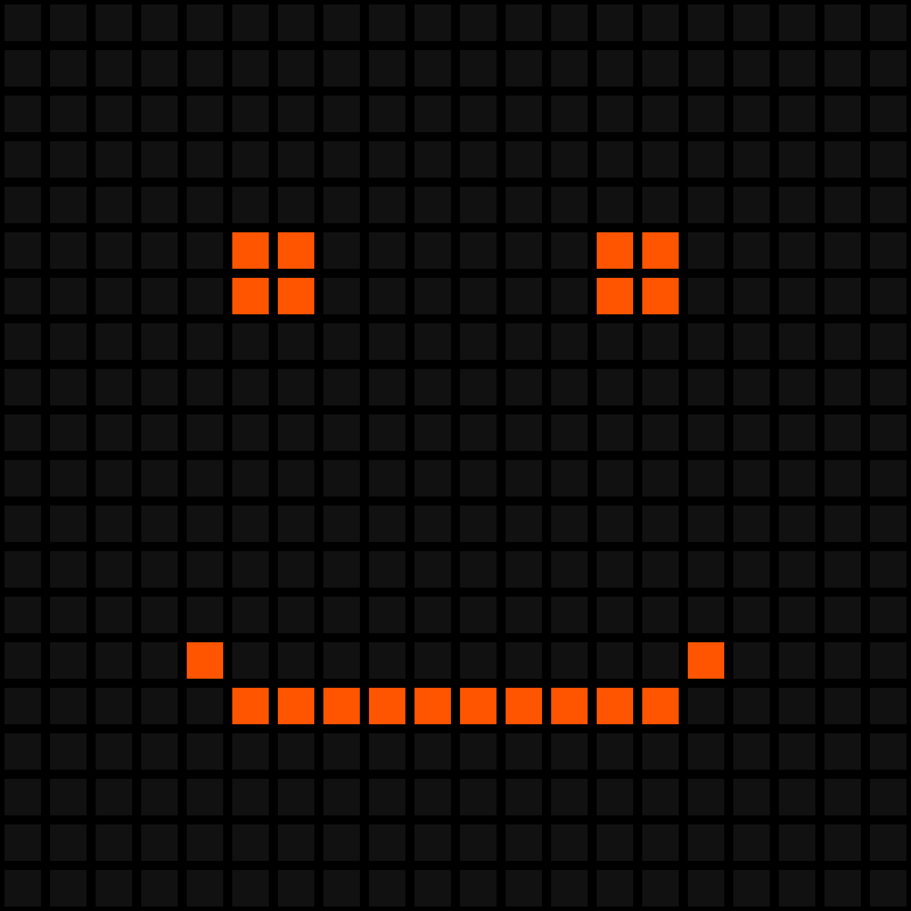

# Line Drawer

## What is this?

I don't know. I just copied [the code](https://en.wikipedia.org/wiki/Bresenham's_line_algorithm#Algorithm) from the wikipedia. And then I used my poor knowlege about typescript (and english) to convert it into typescript. Inspired by mattbatwings' [line drawer video](https://youtu.be/vfPGuUDuwmo).

## How To Use?

1. `npm install`
2. Write some code like this:

```js
// -=-=-=-Write your code between this-=-=-=- \\
await plotLine(x0, y0, x1, y1);
// -=-=-=-and this-=-=-=- \\
```

3. Compile the typescript code. (`tsc`)
4. Run the code (`node index.js`).
5. The code will copy the data uri to your clipboard.
6. Paste it to your browser. (`Ctrl + V`)

# Smiling Face



```js
// -=-=-=-Write your code between this-=-=-=- \\
//#region Eyes
await plotLine(5, 5, 6, 5);
await plotLine(5, 6, 6, 6);
await plotLine(size[0] - 7, 5, size[0] - 6, 5);
await plotLine(size[0] - 7, 6, size[0] - 6, 6);
//#endregion
//#region Smile
await plotLine(5, size[1] - 5, size[0] - 6, size[1] - 5);
await plotLine(4, size[1] - 6, 4, size[1] - 6);
await plotLine(size[0] - 5, size[1] - 6, size[0] - 5, size[1] - 6);
//#endregion
// -=-=-=-and this-=-=-=- \\
```

> The `size` is the canvas' size. :)
